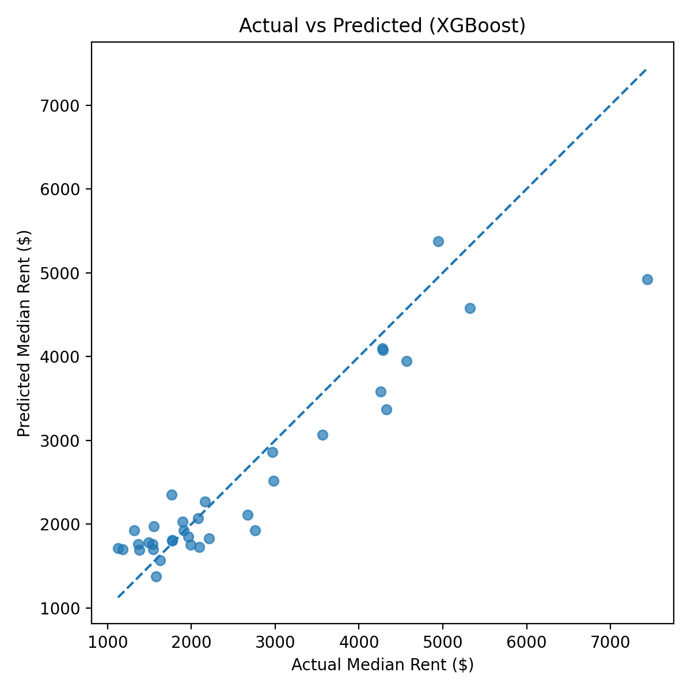
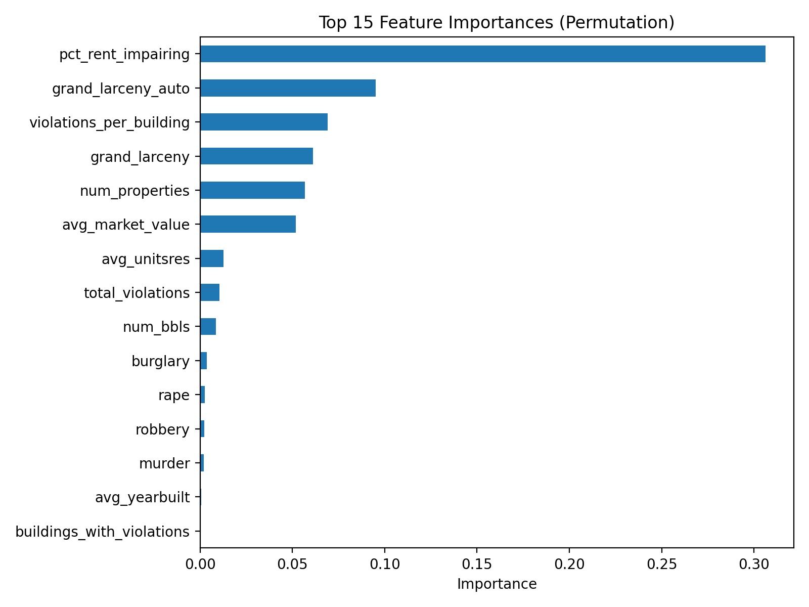

# NYC Neighborhood Rent Prediction (NTA-Level)

An end-to-end ML pipeline to predict median monthly rent across NYC's residential neighborhoods (NTA 2020 boundaries), built to explore a specific question: how much of a neighborhood's rent can you explain using only public administrative data — housing quality, crime, and property market signals — without any information about individual units?

This project is as much a case study in **honest model evaluation and data validation** as it is a rent predictor: several feature and modeling ideas were tested, validated (or rejected) using cross-validation rather than a single train/test split, a data quality issue was found and excluded rather than silently accepted, and a promising-looking feature change was reverted after deeper inspection showed it didn't hold up. That process, while, not the final accuracy number, is the actual point of this project.

An interactive Streamlit app lets you explore predictions by neighborhood, filter by budget, and see where the model is most and least confident. **[Try it live →](https://nyc-rent-prediction-l3nvrmrqtpxsjvmuxwpmeu.streamlit.app/)**

## Why this project?

Many NYC neighborhoods lack reliable rent statistics despite having rich administrative data available. The starting question:

> Can we predict neighborhood-level median rent using public signals about housing quality, safety, and property markets, and how far can that get us without unit-level data?

## Data & Features

All features are aggregated to NTA (Neighborhood Tabulation Area), one row per neighborhood, built via SQL joins in PostgreSQL/PostGIS at a consistent geographic grain.

**Integrated sources:**

1. Housing stock / built environment (PLUTO aggregates)
2. Maintenance & rent-impairing violations
3. Crime counts by category (later converted to per-1,000-unit rates. See Methodology)
4. Property valuation aggregates
5. Rent labels aggregated to NTA (median rent)
6. Borough (derived from the NTA code itself)

**Investigated but excluded:**

- _School performance data._ DOE school data (`schools` table) was joined in early on, but on inspection, the source shapefile only contains school locations and identifiers, no performance metrics. `avg_ats` was not recoverable as originally scoped (the `ats` field is a school ID, not a score). A `school_count` feature (schools per NTA via spatial join) was technically feasible, but the PostGIS database used to compute it is no longer available in this environment; recomputing it would require re-provisioning the SQL pipeline from source shapefiles. Both were excluded from the final model rather than silently dropped.

- _Non-residential NTAs._ During validation, 44 of 260 NTAs were found to have near-zero housing unit counts, causing erratic per-unit crime rates (e.g., one NTA showed an auto-theft rate over 1,000x typical values). Investigation showed these are parks, cemeteries, airports, and similar non-residential land, Central Park, LaGuardia Airport, Rikers Island, Green-Wood Cemetery, and 40 others, included in the NTA boundary system despite having no real rental market. All 44 were unlabeled (no observed rent) and were excluded from the final predicted output.

**Final dataset:** 216 residential NTAs, **175** with observed rent (used for training/evaluation), **41** with rent predicted by the model.

## Methodology

**1. Feature engineering (SQL + Python)**

- Built a unified modeling table in Postgres at NTA grain
- Log-transformed rent to stabilize variance
- **Iteration 1:** Raw crime counts (murder, robbery, grand larceny, etc.) were normalized to rates per 1,000 housing units, since raw counts partly proxied neighborhood size rather than actual safety
- **Iteration 2:** Added borough as a categorical feature, after noticing the model systematically underpredicted high-rent Manhattan neighborhoods, location wasn't represented anywhere in the original feature set

**2. Model selection — evaluated for convergence, not just for a winner**
Four model families were trained and each independently tuned via `RandomizedSearchCV` (5-fold CV, 30 iterations): Random Forest, HistGradientBoostingRegressor, LightGBM, XGBoost.

| Model         | CV RMSE (log) |
| ------------- | ------------- |
| XGBoost       | **0.2542**    |
| HistGB        | 0.2568        |
| Random Forest | 0.2568        |
| LightGBM      | 0.2611        |

All four converged within **0.254–0.261**, with each model's own cross-validation standard deviation (~0.04–0.05) larger than the gap between the best and worst model. This is a meaningful finding in itself: it indicates the feature set, not model choice, is the binding constraint on accuracy. Further tuning or trying additional model families was deprioritized in favor of this conclusion.

**3. Uncertainty quantification**
Rather than a single point estimate, the pipeline also trains quantile models (10th/90th percentile) to produce prediction intervals for every neighborhood. This was validated, not assumed: interval width correlated with actual rent at **r ≈ 0.80** on the test set, and 0 of 35 test predictions showed quantile crossing, confirming the model is appropriately less confident on the neighborhoods it predicts least accurately (high-rent outliers), rather than producing uniformly-sized, falsely-confident intervals. These intervals are surfaced directly in the Streamlit app for every neighborhood.

**4. An idea that didn't pan out (kept for transparency)**
A continuous "distance to Midtown Manhattan" feature was engineered from NTA centroid geometry, hypothesizing that a continuous distance measure would outperform the coarser borough categories. It became the single most important feature by permutation importance, but did not measurably improve CV RMSE (models moved within noise, some slightly better, some slightly worse), and destabilized the quantile interval calibration (previously-tight intervals for typical-rent neighborhoods became implausibly wide). It was reverted. Conclusion: borough had already captured most of the recoverable location signal; higher spatial resolution didn't unlock additional accuracy with this feature set and sample size.

**5. Data validation**
Beyond feature engineering, the pipeline includes two validation steps that changed the final output: identifying that school performance data wasn't usable as sourced (above), and identifying and excluding the 44 non-residential NTAs (above). Both are the kind of checks that don't show up in a model's accuracy score but affect whether its output is trustworthy.

**6. Prediction**
Final tuned model generates rent predictions for NTAs missing observed rent, producing a complete citywide residential rent table.

## Results

**Final model: XGBoost**

- CV RMSE (log): **0.2542**
- Test RMSE (log): 0.2030
- Test MAE (log): 0.1640
- Test MAE: **$417** (35 held-out NTAs; reported as a secondary sanity check, CV is the primary metric given the small test set)

**In plain terms:** the model's typical error is roughly 20–25% of a neighborhood's actual median rent. This reflects a real limitation of the problem as scoped, not a failure to optimize: NTA-level aggregates (violations, crime, valuation) capture neighborhood _character_ but not unit-level drivers of rent (square footage, bedroom count, amenities, exact location within a neighborhood) that account for most of the variance in any individual listing. The convergence of four independently-tuned model families to the same error range is direct evidence this is a feature ceiling, not a modeling gap.

**Key drivers (permutation importance, final model):**

- `pct_rent_impairing` (0.36) — housing quality, consistently the strongest single signal by a wide margin
- `borough_MN` (0.12) and `borough_BK` (0.08) — location, added specifically to address underprediction in high-rent Manhattan neighborhoods
- `violations_per_building` (0.06) and `avg_market_value` (0.06) — housing condition and market structure
- `grand_larceny_auto_rate` (0.05) and other normalized crime rates (murder, burglary, grand larceny) — safety signals




## Limitations

- **Small sample:** 175 labeled NTAs; a 20% test split is only 35 rows, so CV metrics (not single-split test metrics) are treated as authoritative throughout this project
- **No unit-level data:** the model cannot capture within-neighborhood rent variation
- **School performance data unavailable** — investigated and documented above, not included
- **Location resolution capped at borough** — finer-grained spatial features were tested and did not improve results with this feature set (see Methodology)

## Interactive demo

**[Live app →](https://nyc-rent-prediction-l3nvrmrqtpxsjvmuxwpmeu.streamlit.app/)**

A Streamlit app (`app/01_streamlit_app.py`) turns the model's output into a browsable tool:

- **Citywide map** — every residential NTA shaded by predicted rent or by prediction uncertainty
- **Budget finder** — filter neighborhoods by max rent, ranked by housing quality and safety signals
- **Neighborhood lookup** — predicted rent, 80% prediction interval, percentile rank citywide, and the underlying violation/crime/market signals behind each estimate
- **Citywide table** with CSV export
- **Model transparency**, tucked into an expander rather than the main flow: final model, typical error, and the neighborhoods where the model's predictions are furthest from observed rent — an honest look at where this approach struggles, not just where it works

The app reads precomputed predictions rather than scoring live, so it stays fast and doesn't duplicate the training pipeline's feature engineering logic.

## Reproducible pipeline

**1️⃣ Place the raw data**

Export the final modeling table from Postgres/PostGIS and place it at:

    data/raw/rental_report_final.csv

If you also want the interactive map in the Streamlit app, place the NTA boundaries export (WKT geometry) at:

    data/raw/nta_boundaries.csv

Note: the raw modeling table isn't included in this repo, since it's exported from a private PostgreSQL/PostGIS database built from several joined data sources. See the Data & Features section above for what it contains.

**2️⃣ Install dependencies**

```bash
pip install -r requirements.txt
```

**3️⃣ Train and evaluate the model**

```bash
python -m src.01_train
```

This will:
- tune and cross-validate 4 model families (Random Forest, HistGradientBoosting, LightGBM, XGBoost)
- select the best on CV RMSE and evaluate it on a held-out test set
- train quantile models (10th/90th percentile) for prediction intervals
- save the trained model artifacts, metrics (`reports/metrics/03_metrics.json`), and figures (`reports/figures/`)

**4️⃣ Predict rent for all NTAs**

```bash
python -m src.02_predict
```

This generates:

    data/processed/04_final_nta_rent_predictions.csv

(non-residential NTAs (parks, cemeteries, airports) are automatically excluded; see `config.py`)

**5️⃣ Build the map data (only needed once, for the Streamlit app)**

```bash
python -m src.build_nta_geojson
```

This converts the NTA boundaries into `data/processed/nta_boundaries.geojson`, which the app reads directly.

**6️⃣ Run the Streamlit app**

```bash
streamlit run app/01_streamlit_app.py
```

The app only reads precomputed files (steps 3–5), it never re-scores or touches raw data itself, so it stays fast and has no modeling dependencies at runtime.

**Live demo:** [nyc-rent-prediction-l3nvrmrqtpxsjvmuxwpmeu.streamlit.app](https://nyc-rent-prediction-l3nvrmrqtpxsjvmuxwpmeu.streamlit.app/)